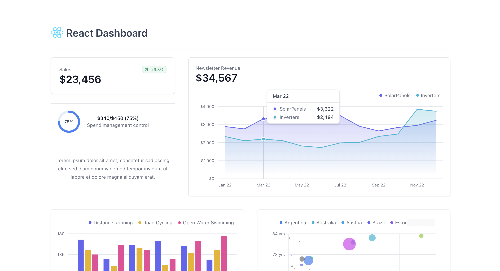

# Docker + React + Vite + Tailwind + TypeScript

## React Dashboard
This template provides a minimal setup to build a data visualization dashboard with React.



## Getting Started

1. **Clone the repository:**

```bash
git clone https://github.com/ntrossat/react-dashboard.git
```

2. **Navigate to the project directory:**

```bash
cd react-dashboard
```

3. **Install dependencies:**

```bash
npm install
```

4. **Start the development server:**

```bash
npm run dev
```

## Docker

To build and run the application in a Docker container, follow these steps:

1. **Build the Docker container:**

```bash
docker compose up --build
```

2. **Run the Docker container:**

```bash
docker compose up
```

## Features

- **React:** A JavaScript library for building user interfaces.
- **Vite:** A fast development server and build tool.
- **Tailwind CSS:** A utility-first CSS framework.
- **TypeScript:** A superset of JavaScript that adds static typing.
- **Docker:** A platform for building, shipping, and running applications.
- **Tremor.js:** Make visualizing data simple again.

## License

This project is licensed under the MIT License. See the [LICENSE](LICENSE) file for details.